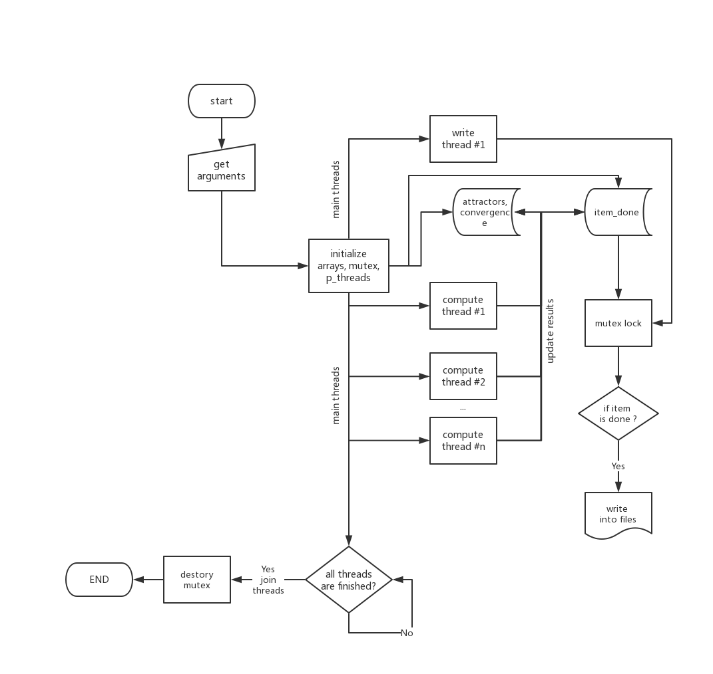

[//]: # (To preview markdown file in Emacs type C-c C-c p)

# [Assignment 2: Threads](https://www.raum-brothers.eu/martin/Chalmers_TMA881_1920/assignments.html#threads)
We will use Newton's method to practice programming with POSIX threads.

## Relevant concepts

- **Memory fragmentation**. In Assignment 0 we learned that it is advantageous
  to allocate memory in contiguous blocks. Since the **Parallel Computing**
  lecture proposed a layout for solving a similar problem where writing is
  done row by row, we will need to allocate memory for one row at a time.
  
- **Writing to file**. Assignment 0 allowed to get insight into difference
  in performance of various ways of writing into file. It became evident that
  using `fwrite()` rather than `fprintf()` can save a lot of time.
  
- **Inlining**. In Assignment 1 we learned that providing additional
  information to the compiler about external (i.e. defined in separate files)
  functions can play a major role. Using `inline` keyword and/or
  **link-time optimizer** can facilitate optimization of the code by the compiler.

- **Elementary functions**. Complicated mathematical operations should be
  avoided when possible. For example, raising a complex number to some power
  and comparing the square root of that to some tolerance can be replaced
  with multiplying out the components explicitly and comparing it to the
  square of the tolerance, which is a known number.

- **Control locking**. If possible the `if-else` statements should be
  avoided. For example, one does not need to check the value of `d` (exponent)
  at each pixel by using **indirect function call** instead. This could
  potentially save us time. However, doing so will exclude the possibility
  of **inlining** the Newton routines.
  
  The comparison of the two approaches showed that both of them result in
  virtually same runtimes.

- **Data locality**. Perform as many operations with data loaded from memory
  as possible to avoid reloading it (e.g. in multiple loops). Having in mind
  the memory access pattern, the matrices should be traversed row by row, instead
  of column by column. Unfusing the loop can make prefetching faster.
  
  Our testing showed that unfusing the loop was not as fast as usage of
  `memcpy()` function when assigning colours to **attractor** (colourful image)
  and **convergence** (greyscale image) from arrays with precomputed colours.
  Also, further subdivision of computations into **blocks** did not enhance
  the performance of our program.

## Intended program layout

The program thus consists of three central functions:  the main function, the compute function, and the write function.
Due to the nature of the problem, the program naturally splits into two subtasks: 
the computation of the Newton iteration and the writing of results to the two output files. 
Multiple threads are used for computation of the Newton iterations, while only one thread is used for writing the results to the files.
A flowchart of the progarm can be seen in the figure.
 

### Main function
The main function takes care of the following:

+ Parsing command line input to get the number of compute threads, number of pixels per line and the exponent of the polynomial 
+ Allocating memory for the attractor, convergence, and item_done arrays (where the computation results are stored),
+ Opening the output files and writing the headers,
+ Creating threads and mutex object for compute and write functions,
+ Joining threads and destroying the mutex object,
+ Closing the output files and freeing allocated memory.

### Compute function
Each compute thread calls the compute function for a specific row in the picture. 
Within the compute function, the following is done:

+ Coordinates of each pixel in the current row are precomputed,
+ A corresponding newton iteration routine is called, depending on the exponent,
+ The results are put in the result arrays and the row is marked done.

The newton iterations subroutine receives the coordinates of the pixel (its real and imaginary part), 
and returns the attractor and convergence number. The attractor number ranges from 0 to 8, depending on the root number.
In cases when the iterations did not converge (or the pixel was close to the origin), a dummy attractor value of 9 is assigned. 
The convergence number (number of iterations) was returned directly for cases when it was lower than 100. 
If it was larger, then the value 100 was returned.
The numerical values of the real and complex roots for each polynomial were precomputed and 
hardcoded for checking the convergence criteria. 
In order to raise a complex number to a given power, a separate multiplication function was defined.

### Write function
The write function takes care of writing results into the files. As it runs concurrently with the computation, 
it writes one row of the results whenever it is marked ready by one of the compute threads.
More specifically, the function takes care of the following:

+ Predefinition of the colour maps for the attractor and convergence results,
+ Checking whether the row is marked done by one of the compute threads (if it's not done the function waits),
+ For each row: converting the Newton iterations results into the RGB triplet with help of the predefined colour maps,
+ Writes the whole row pixel data to the output files using `fwrite`.

